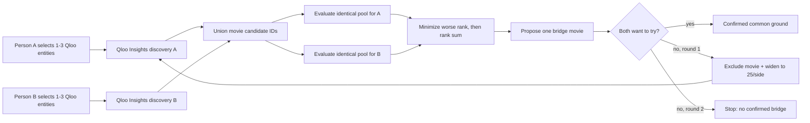

# CommonGround architecture

CommonGround deliberately separates **Qloo's cultural data layer** from the **two-person decision policy**.

## 1. Entity selection

The browser calls `GET /api/search?q=...`. The server calls Qloo `/search` with `types=movie,artist`, filters defensively to those supported types, and returns stable IDs plus canonical names/types.

The browser sends selected IDs back in `profile_a_entities` and `profile_b_entities`. The Qloo API key never reaches the browser.

## 2. Candidate discovery

For each profile, the server calls `/v2/insights` with:

- `filter.type=urn:entity:movie`
- `signal.interests.entities=<selected IDs>`
- `feature.explainability=true`
- `sort_by=affinity` explicitly, so rank semantics do not depend on an undocumented/default ordering
- `take=20` in round 1, `take=25` in round 2
- `filter.exclude.entities=<vetoed IDs>` when needed

A and B discovery requests run in parallel.

## 3. Same-pool evaluation

The two discovery lists are unioned. Round 1 therefore has at most 40 candidates; round 2 at most 50.

The exact same union is evaluated once for A and once for B using `filter.results.entities`. These two calls also run in parallel.

A missing result remains **unknown**. It is not converted to zero affinity or a negative preference.

## 4. Decision policy

Only candidates measured for both people are eligible. CommonGround sorts by:

1. lower `max(rank_A, rank_B)`;
2. lower `rank_A + rank_B`;
3. stable name order as a deterministic final tie-break.

This is a transparent least-misery-style heuristic, not a claim that rank is a probability of enjoyment.

## 5. Explainability

For a live result, the UI shows an input interest only if that input entity ID is present in the recommendation's Qloo explainability payload. If explainability is unavailable, the UI says so rather than generating an explanation.

## 6. Feedback loop

Each person chooses:

- `Want to try`
- `Already know it`
- `Not for me`

Both choosing `Want to try` is the only success condition. Any other round-1 outcome excludes the proposal and triggers one wider search. A non-acceptance in round 2 ends with no confirmed bridge.

## 7. Fixture/public preview

GitHub Pages cannot safely hold the Qloo API key or run the Python server. The Pages build therefore contains only precomputed fixture scenarios generated by `build_static_preview.py` from the same Python agent policy. `tests/test_static_preview.py` verifies the public JSON and HTML stay in sync with that policy.

For the final submission, `docs/runtime_config.json` points the same Pages frontend at the live Render API. The page loads immediately from GitHub Pages and begins waking the free backend before the judge interacts with it. Fixture mode remains available by clearing `api_base` or appending `?static=1`.

## 8. Public-demo protection

The server keeps no user profile database and disables access logging. To protect the hackathon Qloo key, it applies a small in-memory per-client request limit to search/bridge endpoints and caps simultaneous bridge executions. This is abuse protection, not authentication; the counters disappear when the free service restarts.

Entity search responses are cached in memory for five minutes (bounded to 256 query keys), so repeated autocomplete queries do not repeatedly consume Qloo requests. Search text, selected entity IDs/names and veto lists are length/count bounded before any Qloo call is made.
