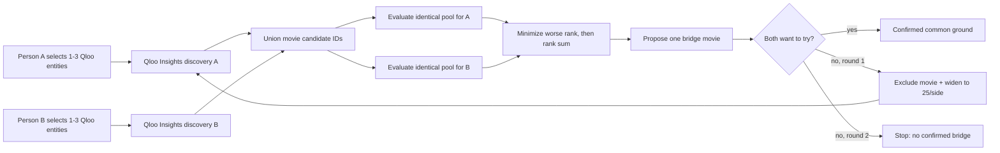

# CommonGround architecture

CommonGround deliberately separates **Qloo's cultural data layer** from the **two-person decision policy**.

## 1. Entity selection

The browser calls `GET /api/search?q=...`. The server calls Qloo `/search` with `types=movie,artist`, filters defensively to those supported types, and returns stable IDs plus canonical names/types.

The browser sends selected IDs back in `profile_a_entities` and `profile_b_entities`. The Qloo API key never reaches the browser.

In live mode the bridge endpoint rejects legacy raw-name profiles entirely. A live bridge can only start from entities explicitly selected through `/api/search`, preventing a second hidden name-to-entity guess inside the agent.

## 2. Candidate discovery

For each profile, the server calls `/v2/insights` with:

- `filter.type=urn:entity:movie`
- `signal.interests.entities=<selected IDs>`
- `feature.explainability=true`
- `sort_by=affinity` explicitly, so rank semantics do not depend on an undocumented/default ordering
- `take=20` in round 1, `take=25` in round 2
- `filter.exclude.entities=<vetoed IDs>` when needed

All movie entities that either person supplied as input tastes are also excluded from discovery and filtered again locally. The proposed bridge must therefore be a **third cultural object**, not one of the seed movies already supplied by either person.

A and B discovery requests run in parallel.

## 3. Same-pool evaluation

The two discovery lists are unioned. Round 1 therefore has at most 40 candidates; round 2 at most 50.

The exact same union is evaluated once for A and once for B using `filter.results.entities`. These two calls also run in parallel.

A missing result remains **unknown**. It is not converted to zero affinity or a negative preference.

## 4. Decision policy

Only candidates measured for both people are eligible. CommonGround sorts by:

1. lower `max(rank_A, rank_B)`;
2. lower `rank_A + rank_B`;
3. stable name order;
4. entity ID as the final deterministic tie-break when two different entities even share the same name.

This is a transparent least-misery-style heuristic, not a claim that rank is a probability of enjoyment.

## 5. Explainability

For a live result, the UI shows an input interest only if that input entity ID is present in the recommendation's Qloo explainability payload. If explainability is unavailable, the UI says so rather than generating an explanation.

## 6. Feedback loop

Each person chooses:

- `Want to try`
- `Already know it`
- `Not for me`

Both choosing `Want to try` is the only success condition. Any other round-1 outcome excludes the proposal and triggers one wider search. A non-acceptance in round 2 ends with no confirmed bridge.

## 7. Public preview modes

GitHub Pages cannot safely hold the Qloo API key or run the Python server. While that key is pending, an empty `docs/runtime_config.json` activates a browser-only **open-data test mode**:

- Wikipedia full-text search recognizes arbitrary public entities and maps them to Wikidata IDs;
- Wikipedia CirrusSearch `morelike:` provides temporary related-page candidate lists;
- related pages are mapped back to stable Wikidata IDs and may be any cultural object in this temporary mode;
- the UI labels the resulting ranks as temporary Wikimedia similarity and explicitly says **NOT QLOO**.

This mode exists to exercise search, ambiguous-entity selection, candidate presentation, veto, and second-round UX without inventing Qloo responses. It is not a substitute for the final Qloo integration.

The Pages bundle also includes precomputed fixture scenarios generated by `build_static_preview.py`; appending `?static=1` forces that deterministic mode. `tests/test_static_preview.py` verifies the fixture JSON and HTML stay in sync with the Python policy.

For the final submission, `docs/runtime_config.json` points the same Pages frontend at the live Render API. The page loads immediately from GitHub Pages, polls `/health` while the free backend wakes, and unlocks the live controls automatically when the API is ready.

## 8. Public-demo protection

The server keeps no user profile database and disables access logging. To protect the hackathon Qloo key, it applies a small in-memory per-client request limit to search/bridge endpoints, bounds the number of remembered limiter keys, and caps simultaneous bridge executions. This is abuse protection, not authentication; the counters disappear when the free service restarts.

Entity search responses are cached in memory for five minutes (bounded to 256 query keys), so repeated autocomplete queries do not repeatedly consume Qloo requests. Search text, selected entity IDs/names and veto lists are length/count bounded before any Qloo call is made.
